<div align="center">



<a href="https://github.com/Chamiya09"></a>
<a href="https://linkedin.com/in/Chamiya09"></a>
<a href="https://twitter.com/Chamiya09"></a>
<a href="mailto:chamiya09@example.com"></a>

</div>

---

## About Me

I am Chamod Ekanayaka, an AI undergraduate student building a strong foundation in machine learning, software engineering, and intelligent systems. I enjoy turning ideas into practical projects, exploring how data becomes decisions, and learning the tools that make modern AI products reliable.

- Studying artificial intelligence, programming, and data-driven systems
- Building projects with Python, web technologies, and machine learning workflows
- Interested in AI applications, automation, computer vision, and intelligent assistants
- Focused on writing clean code, learning deeply, and improving one project at a time

---

## Tech Stack

<div align="center">


</div>

---

## Current Focus

```text
AI Fundamentals        Machine Learning       Data Structures
Python Projects        Web Development        Research Mindset
```

---

## GitHub Activity

<div align="center">


</div>

---

<div align="center">


### Learning today. Building for tomorrow.

</div>
